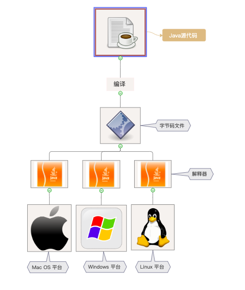

# Java简介
******

## 1. Java历史
1995年5月23日，
Sun Microsystems
公司宣布Java语言诞生，当时使用Java的总人数还不到30人，可能包括Java语言之父
James Gosling
在内的大多数联合创始人都无法预想，Java在未来二十年间，居然会给互联网乃至我们的生活带来如此深远的影响。

目前Java提供以下三个版本：
* **Java EE <Java平台企业版>** - Java Platform, Enterprise Edition；
* **Java SE <Java平台标准版>** - Java Platform, Standard Edition；
* **Java ME <Java平台微型版>** - Java Platform, Micro Edition；

2006年，Sun公司在JavaOne大会上，宣布在GNU通用公共协议（GPL）的架构下向开源世界贡献Java平台，这次开发的Java版本包含了标准版（Standard）、微型版（Micro
）及企业版（Enterprise），这是一个具有"历史性意义"的改变。

## 2. 语言特性
Java语言的诞生，重新定义了
面向对象编程（OOP）。
Java语言的创建，有以下几个目标：
* 简单易学，面向对象
* 必须健壮且安全
* 摆脱平台的依赖性，跨平台
* 高性能执行
* 必须是可解释的，多线程的，动态的。

### 2.1 面向对象
面向对象（Object Oriented）指的是一种编程方法。面向对象的主要思想是：围绕着我们所操纵的"事物"（即对象）来设计软件。
计算机硬件的发展为软件技术的发展提供了更好的土壤，为了让大型软件项目易于管理，降低开发和维护的成本，面向对象也就应运而生。
为了了解面向对象技术的诞生原因，我们下面介绍集中比较具有代表性的软件技术。

#### 2.1.1 汇编语言
汇编语言是软件技术的开端，这种语言与机器语言非常接近，并且可以很容易的转换为可执行代码。使用汇编语言的程序员必须了解计算机的详细体系结构才能编写程序。

#### 2.1.2 程序语言
在汇编语言之后，开发了高级语言，可以使用语言的编译器（如gcc）将高级程序代码转换为机器指令。
这样程序员无需再深入了解计算机硬件的体系结构。
为了提高代码的可复用性并最大程度的减少GOTO指令的使用，引入了
面向过程
技术。
虽然简化了软件流程控制的创建和维护，但是忽视了数据组织。调试和维护许多全局变量的程序，编程了程序员的一场噩梦。

### 2.2 跨平台
我们也许常常听到一句口号 -- ***"一次变异，到处执行（Write Once,run 
anywhere）"***，这里说的就是Java的跨平台性，我们首先来看下在
C
或
C++
中，我们首先要将源代码文件编译为机器代码文件，然后再去执行它。这个过程中，机器代码文件必须在为其编译的平台才能执行（这里的平台指的是Windows
、Linux、Mac OS等），也就是说，我们的代码如果希望在多个平台执行，那就必须多次编译程序。这不仅给程序员带来了繁琐的开发步骤（代码少做修改就要重新编译整个程序），
也给程序带来了更大的漏洞风险。当代码已经编译为可执行文件时，这个可执行文件不能动态更改，此时需要修改代码重新编译，以替换旧的可执行文件。 

我们来看看Java是如何做的吧：
Java的思想是，将代码编译为中间语言，中间语言就是字节码，解释器是Java虚拟机（JVM）。字节码文件可以通用，JVM是特定于平台的。如下图所示：

每一个平台都需要一个JVM，这里JVM是实现"到处执行"的关键前提，所以在Java
中，我们只需要生成一个字节码文件，就可以保证我们编写的程序在任何平台都能运行了。

### 2.3 标准化
在Java中，提供了大量的标准化库，这保证了我们使用统一的接口对程序进行控制。

### 2.4 异常处理
异常处理的老方式是：让每个函数返回一个错误代码，调用者会检查其返回的内容，这样就导致了代码中到处都是错误码的校验，从而让源码变得难以阅读。

在异常处理的新方式中，函数或方法不再返回错误码，而是以抛出异常的方式来进行异常处理，在Java中可以使用
catch
关键字来捕获在
try
语句块中所发生的异常。这样我们无需频繁通过定义错误代码的方式处理异常，代码可读性大大提高。

### 2.5 动态类加载
在Java中，如果在执行阶段不需要执行某个类，那么这个类就不会被编译为字节码。在网络编程中，这个特性非常常用。当我们不知道将执行什么代码时，程序可以从文件系统或远程服务加载类。

### 2.6 自动垃圾回收机制
在常规语言中（例如C或C++）中，程序员

