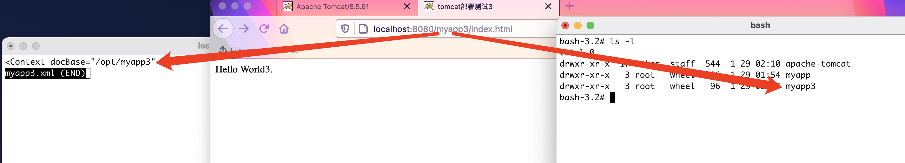

## 使用【Mac OS】
***
### 下载
访问 <https://tomcat.apache.org> 选择你需要的版本下载

### 安装
1. 将下载的软件解压到`/opt/apache-tomcat`目录下
2. 进入`/opt/apache-tomcat/bin`目录下，执行`./startup.sh`, 启动tomcat，如下图：

3. 启动成功后我们打开浏览器输入：http://localhost:8080/ 当出现下图所示页面，表示Tomcat启动成功，恭喜～
 
   
### 目录结构

### 启动和关闭命令
`./startup.sh`和`./shutdown.sh`

### 发布项目的三种方式
#### 1.webapps部署（最简单）
直接放置在webapps目录下, 例： 在webapps新建文件夹myapp

这种方案支持热更新，一般在开发完毕后来使用。

### 2.server.xml部署（了解）
在`conf/server.xml`中找到标签`<Host>`，添加标签`<Context>`

缺点
> 1. 配置文件修改完毕后，需要重启服务器后才能生效
> 2. server.xml是tomcat的核心配置文件，如果少有不慎操作事物，整个tomcat启动失败

### 3.独立xml部署（掌握）
在/opt/apache-tomcat/conf/Catalina/localhost新建xml配置文件myapp3.xml

> 1. myapp3 文件名就是虚拟路径 
> 2. 集合了部署1和部署2的优点，推荐使用 